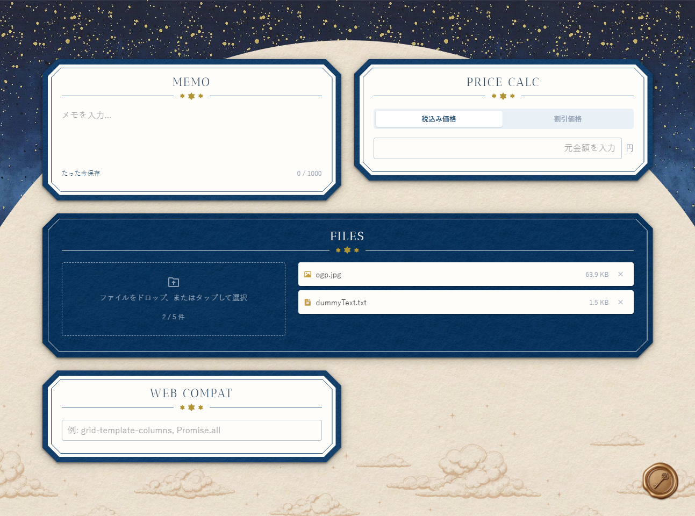

# Toolbox — 日常使いの便利ツール集

日常で頻繁に使う小さなツール（価格計算・メモなど）を1つのダッシュボードにまとめたWebアプリです。<br/>
プロジェクトにAIエージェントを導入し、AIを活用した安全な開発やCI/CDによる自動化など、開発・運用フローの検証を目的としています。

- 個人開発
- 制作年度：2026
- URL：https://toolbox.1coffee9milk.com<br/>メールアドレス：`test@example.com` / パスワード：`test1234`

&nbsp;

## スクリーンショット



&nbsp;

## サイト構成

| パス     | ページ         | 概要                                 |
| -------- | -------------- | ------------------------------------ |
| `/`      | ダッシュボード | 全ツールをグリッドに表示             |
| `/login` | ログイン画面   | メールアドレス・パスワードによる認証 |
| `*`      | 404ページ      | カスタムエラーページ                 |

### ツール一覧

| ツール               | 機能                                                                     |
| -------------------- | ------------------------------------------------------------------------ |
| 価格計算             | 税込み価格（8%/10%）・割引価格の計算機能                                 |
| メモ                 | 最大1000字のメモ機能                                                     |
| ファイルアップロード | ファイルのアップロード・ダウンロード機能。ドラッグ&ドロップ対応          |
| ブラウザ互換性検索   | CSS/JS/WebAPIなどのブラウザ互換性検索機能。サジェスト、MDNへのリンク表示 |

&nbsp;

## 技術スタック

### フロントエンド

| 技術                    | 用途                       |
| ----------------------- | -------------------------- |
| Next.js 16 (App Router) | フルスタックフレームワーク |
| React 19                | UIライブラリ               |
| TypeScript              | 型安全性の確保             |
| CSS Modules + Sass      | スコープ付きスタイル管理   |

### バックエンド・認証

| 技術        | 用途                 |
| ----------- | -------------------- |
| Auth.js     | 認証                 |
| bcryptjs    | パスワードハッシュ化 |
| PostgreSQL  | データベース         |
| Drizzle ORM | O/Rマッパー          |

### インフラ・CI/CD

| 技術           | 用途                                                |
| -------------- | --------------------------------------------------- |
| AWS S3         | ファイルストレージ（署名付きURL）                   |
| AWS EC2 / RDS  | 本番インフラ                                        |
| Docker         | コンテナ化                                          |
| Nginx          | リバースプロキシ・SSL終端                           |
| Amazon ECR     | Dockerイメージレジストリ                            |
| GitHub Actions | CI/CD（audit / lint / test / build / e2e / deploy） |
| Sentry         | エラーモニタリング                                  |

### 開発ツール

| 技術                | 用途                                                             |
| ------------------- | ---------------------------------------------------------------- |
| Vitest              | ユニットテスト                                                   |
| Playwright          | E2Eテスト                                                        |
| ESLint              | 静的解析（perfectionist / security / unused-imports プラグイン） |
| Prettier            | コードフォーマッター                                             |
| Husky + lint-staged | コミット前の自動フォーマット・Lint                               |
| Dev Containers      | コンテナ化された開発環境                                         |
| Claude Code         | AIコーディングエージェント                                       |

&nbsp;

## アーキテクチャ

```
[ブラウザ]
    │ HTTPS
    ▼
[AWS EC2]
    ├── Nginx（リバースプロキシ・SSL終端）
    │       ▼
    └── Docker: Next.js (App Router)
            ├── PostgreSQL（AWS RDS）
            └── AWS S3（署名付きURLでファイル送受信）
```

&nbsp;

## AIエージェントの利用と安全性の担保

AIエージェントで自律的に開発を進めるにあたり、「開発環境」「AIエージェント」「運用フロー」の3つの点から安全性を担保しています。

### 開発環境の隔離

ホストマシンの安全のため、Dockerコンテナ内で開発を行っています。

- **Dockerコンテナで開発環境を分離** — ホストのプロセス・ファイルシステムから隔離し、プロジェクトディレクトリ以外への直接アクセスを遮断
- **非rootユーザーでコンテナ内のプロセスを実行** — コンテナ内システムファイルの変更や管理者権限を必要とする操作を制限
- **ホストのマウントをプロジェクトディレクトリに限定** — プロジェクト外のホストファイルへのアクセスを防ぐ
- **SSHキーを読み取り専用でマウント** — SSHキーの書き換え・削除を防止
- **Docker socketは未マウント** — コンテナ内から新規コンテナの起動やホスト操作を行う典型的な脱出経路を塞ぐ

### AIエージェントの権限制御

コンテナの中でも、設定ファイルやHook機能を用いてAIエージェントが実行できる操作を制限しています。

- **機密ファイルへのアクセスを拒否** — `.env`やSSHキー、証明書などの秘密ファイルの中身を、AIが読み取ること自体を防ぐ
- **環境変数経由での秘密情報の露出を防止** — 本番環境と共有している変数を参照するコマンドや、環境変数を丸ごとダンプする操作を拒否
- **外部サイトへのアクセスをホワイトリストで制御** — 登録済みドメイン以外へのアクセスは確認を必須にし、外部サイトからのプロンプトインジェクションを防ぐ
- **危険なコマンドを拒否** — ファイル削除やGit履歴の破壊的な書き換え、過剰な権限変更、DBの破壊、リモートから取得したスクリプトを直接実行するような危険なコマンドを実行前にブロックする
- **PR作成前に確認を必須化** — PR作成をきっかけにCIチェックが走り、通過すればマージ・本番デプロイまで一連の流れが自動で進むため、意図しない変更が確認なしに本番環境に反映されるのを防ぐ
- **新規パッケージ追加前に確認を必須化** — 脆弱性のあるパッケージやtyposquatting（タイプミスを狙った偽パッケージ）などを、気づかないまま導入してしまうことを防ぐ
- **DBマイグレーション実行前に確認を必須化** — データやスキーマが意図せず変更されることを防ぐ

### 運用フローの保護

万が一、AIエージェントが制御をすり抜けた場合に備え、mainブランチを保護しています。

- **Branch protection rulesでmainブランチへの直接push・force pushを禁止** — mainブランチへの直接反映や履歴の破壊を防ぐ
- **必須CIチェック（audit / lint / test / build / e2e）の通過をマージ条件に設定** — 脆弱性のある依存パッケージやテスト・ビルドに失敗する状態のコードが、そのまま本番へ反映されてしまうことを防ぐ

&nbsp;

## 開発・運用フロー

### 機能開発フロー

```
[人間] 計画・要件、設計方針を決める
  ↓
[AI] Dockerコンテナ内でコーディングエージェントが実装
  ↓
[人間] 内容を確認し、プルリクエスト作成を承認
  ↓
[AI] プルリクエストを作成
  ↓
[GitHub Actions] audit → lint → ユニットテスト(Vitest) → build → E2Eテスト(Playwright) を実行
  ↓
[AI] 必須CIチェックの通過を確認し、squashマージを実行
  ↓
[GitHub Actions] Dockerイメージをビルド → Amazon ECRにプッシュ → SSM経由でEC2にデプロイ指示を送信
  ↓
[AWS EC2] 新イメージをpull → 旧コンテナを差し替え → マイグレーション実行 → 新コンテナ起動
```

### 依存関係の自動更新フロー

```
[Dependabot] 週次でnpm依存関係をチェックし、patch/minor更新をグループ化してPR作成
  ↓
[GitHub Actions] audit → lint → ユニットテスト(Vitest) → build → E2Eテスト(Playwright) を実行
  ↓
[GitHub Actions] patch・minorの更新はCI通過後、専用ワークフローが自動でsquashマージ
  ↓
[人間] major更新のみ、内容を確認して手動でマージ判断
```

&nbsp;

## 今後の展望

これまでの個人開発や実務では、デプロイや依存関係の更新を手動で行ってきましたが、本プロジェクトで検証したAIエージェントの安全対策やCI/CDの運用フローを、今後は開発中の[多機能生産性管理アプリ](https://github.com/aoto-me/scheduler_public)や他プロジェクトへも展開していく予定です。
