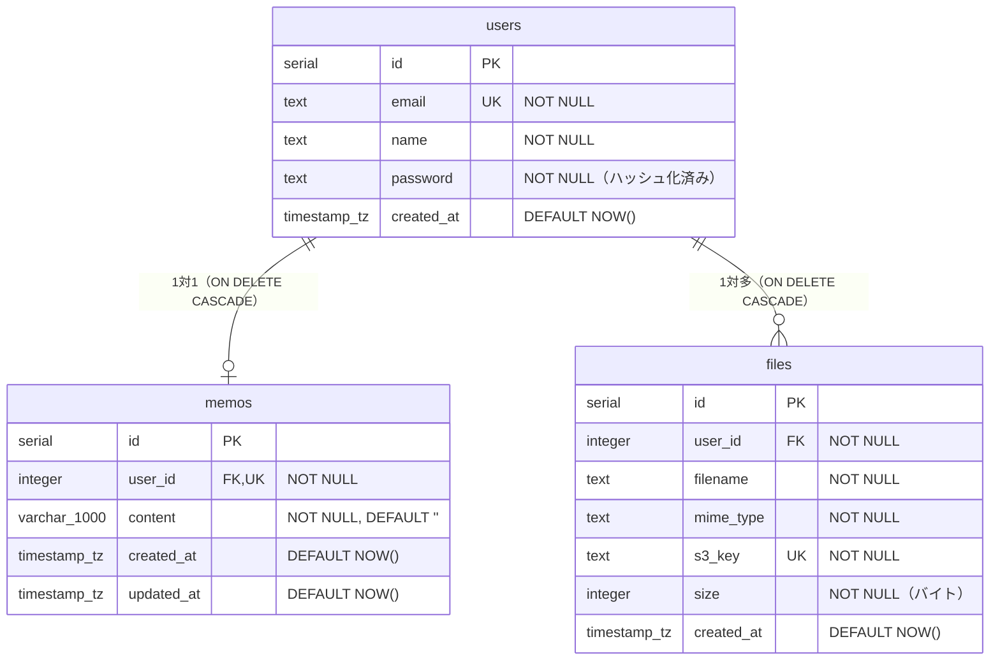

# DB設計

## 1. ER図

## 2. テーブル定義書

### users

| カラム名   | 型                       | 制約                    | 備考                         |
| ---------- | ------------------------ | ----------------------- | ---------------------------- |
| id         | serial                   | PRIMARY KEY             |                              |
| email      | text                     | NOT NULL, UNIQUE        | ログインID                   |
| name       | text                     | NOT NULL                | 表示名                       |
| password   | text                     | NOT NULL                | bcryptjsでハッシュ化して保存 |
| created_at | timestamp with time zone | NOT NULL, DEFAULT NOW() |                              |

### memos

| カラム名   | 型                       | 制約                                             | 備考                                       |
| ---------- | ------------------------ | ------------------------------------------------ | ------------------------------------------ |
| id         | serial                   | PRIMARY KEY                                      |                                            |
| user_id    | integer                  | NOT NULL, UNIQUE, FK→users.id, ON DELETE CASCADE | UNIQUE制約によりユーザー1人につき1レコード |
| content    | varchar(1000)            | NOT NULL, DEFAULT ''                             | メモ本文。上限1000文字                     |
| created_at | timestamp with time zone | NOT NULL, DEFAULT NOW()                          |                                            |
| updated_at | timestamp with time zone | NOT NULL, DEFAULT NOW()                          |                                            |

### files

| カラム名   | 型                       | 制約                    | 備考                     |
| ---------- | ------------------------ | ----------------------- | ------------------------ |
| id         | serial                   | PRIMARY KEY             |                          |
| user_id    | integer                  | NOT NULL, FK→users.id   | ON DELETE CASCADE        |
| filename   | text                     | NOT NULL                | 元のファイル名           |
| mime_type  | text                     | NOT NULL                | 例: `image/png`          |
| s3_key     | text                     | NOT NULL, UNIQUE        | S3オブジェクトキー       |
| size       | integer                  | NOT NULL                | ファイルサイズ（バイト） |
| created_at | timestamp with time zone | NOT NULL, DEFAULT NOW() |                          |

## 3. インデックス一覧

| テーブル | インデックス名    | カラム  | 種別        | 備考                         |
| -------- | ----------------- | ------- | ----------- | ---------------------------- |
| users    | （PK）            | id      | PRIMARY KEY |                              |
| users    | （暗黙）          | email   | UNIQUE      |                              |
| memos    | （PK）            | id      | PRIMARY KEY |                              |
| memos    | （暗黙）          | user_id | UNIQUE      |                              |
| files    | （PK）            | id      | PRIMARY KEY |                              |
| files    | files_user_id_idx | user_id | INDEX       | ユーザーのファイル一覧取得用 |
| files    | （暗黙）          | s3_key  | UNIQUE      |                              |

## 4. 接続ユーザー

本番（RDS）・ローカル（Docker）ともに、PostgreSQL のマスターユーザーで接続している。アプリ専用の権限限定ユーザーは作成していない。 
`DATABASE_URL` はアプリの通常リクエストとマイグレーションで共用しているため、マイグレーション時に `CREATE TABLE` / `ALTER TABLE` 権限が必要になる。 
この兼用を理由として、あえてマスターユーザーを使い続けている。

## 5. マイグレーション運用方針

### コマンド

| 操作                             | コマンド                   |
| -------------------------------- | -------------------------- |
| マイグレーションファイル生成     | `npx drizzle-kit generate` |
| マイグレーション適用（ローカル） | `npx tsx db/migrate.ts`    |

### ルール

- `drizzle-kit migrate` は使用しない。`__drizzle_migrations` テーブルへの履歴記録が不安定になるため
- `db/migrate.ts` は `drizzle-orm/node-postgres/migrator` を使い、適用済み履歴を確実に管理する
- マイグレーションファイルは `./drizzle/` ディレクトリに生成される
