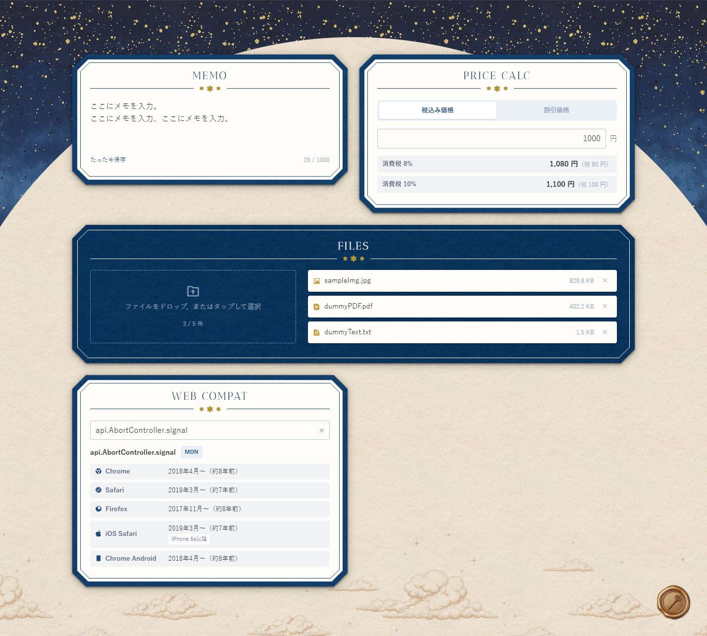

# 詳細設計: ダッシュボード

## 1. 画面レイアウト・UI要件

- ダッシュボードは1ページ構成（`/`）
- 全ツールをグリッドレイアウトで表示（2カラム）
- 各ツールはカード形式（ヘッダー + ボディ）



### ツール一覧

| ツールID        | 表示名     | 幅              | 備考         |
| --------------- | ---------- | --------------- | ------------ |
| memo            | Memo       | 1カラム         |              |
| priceCalculator | Price Calc | 1カラム         |              |
| fileUpload      | Files      | 2カラム（全幅） | ダークテーマ |
| browserCompat   | Web Compat | 1カラム         |              |

### デフォルト表示順

1. Memo
2. Price Calc
3. Files（全幅）
4. Web Compat

## 2. ツール並べ替え機能

- @dnd-kit でD&Dを実装
- マウス・タッチ両対応（タッチは500ms長押しで起動、8px以内の揺れは誤操作として無視）
- 並び順は `localStorage`（キー: `dashboard-tool-order`）に保存
- ページリロード後も順序を復元

### 並べ替えルール

- 通常のツール（1カラム）: ドラッグ先と位置をスワップ
- Files（全幅）: 行単位でスワップ（1カラムツール2個分の行ごと移動）
- FilesをFilesの上にドロップした場合: 何もしない

### localStorageの読み込みロジック

1. 保存済みの順序を読み込む
2. 未知のIDはフィルタリングして除外
3. 保存済みに含まれていないツールは末尾に追加
4. 読み込み失敗（JSONパースエラー等）はデフォルト順にフォールバック

## 3. 初期データ取得

`page.tsx`（async Server Component）がレンダリング時に DB から初期データを並列取得し、クライアントコンポーネントに渡す。

```
page.tsx (Server Component)
  ├── auth() で認証チェック → 未認証時は /login にリダイレクト
  ├── Promise.all([
  │     db.select().from(memos).where(userId),
  │     db.select().from(files).where(userId),
  │   ])
  └── DashboardDataProvider に initialMemo / initialFiles を渡す
```

### DashboardDataProvider

- `components/layout/DashboardDataProvider/` に配置（Client Component）
- `DashboardDataContext` を作成し、初期データをツールコンポーネントに提供
- `useDashboardData()` フックで各ツールから取得可能

### 渡されるデータ形式

```ts
initialMemo: {
  content: string;
  updatedAt: string | null;
}
initialFiles: Array<{
  id: number;
  filename: string;
  mimeType: string;
  size: number;
  createdAt: string;
}>;
```

## 4. セッション管理

- サーバー側: `page.tsx` の `auth()` で初回アクセス時に認証チェック（未認証 → `/login` にリダイレクト）
- クライアント側: `SessionGuard` コンポーネントがダッシュボード全体をラップし、next-auth の `useSession()` で操作中のセッション状態を監視

### セッション期限切れの検知

- 「一度でも認証済みになった」かを `useRef` で追跡
- 初回アクセス時に未認証 → サーバー側の `auth()` または ミドルウェアが `/login` にリダイレクト
- 操作中にセッション切れ → 「Session Expired」ダイアログを表示

### Session Expiredダイアログ

- メッセージ: 「セッションが切れました。再ログインしてください」
- OKボタン押下 → `/login` にリダイレクト

## 5. PWA対応

### スタンドアロン表示

- `manifest.ts` でPWAマニフェストを定義
- スマホのホーム画面にインストールしてネイティブアプリのように起動
- ブラウザUIを非表示（スタンドアロンモード）

### Pull to Refresh

- iOS PWAのスタンドアロンモードでのみ有効（ブラウザでは無効）
- ページ最上部（`scrollY === 0`）から150px以上の下スワイプで更新
- スクロール可能な子要素の中では誤作動しないよう制御
- 更新処理中（保存中等）はブロックし、トースト通知「保存中のため、今は更新できません」を表示

### Pull to Refreshの状態遷移

```
idle → pulling（スワイプ中）→ ready（150px超）→ refreshing（window.location.reload()）
               ↓
          idle（スワイプ不足で離した場合）
```

## 6. SealingWax（ログアウトボタン）

- ダッシュボードページに固定表示されるログアウトボタン
- 封蝋（シーリングワックス）の画像（`/img/sealing-wax.webp`、75×75px）をボタンにしたデザイン
- クリックすると `signOut({ callbackUrl: '/login' })` でログアウトし、ログイン画面に遷移する

## 7. トースト通知

ダッシュボードレイアウト全体を `ToastProvider` がラップしており、全ツールから `useToast()` フックでトーストを表示できる。

```ts
const { showToast } = useToast();
showToast('メッセージ');
```

### 仕様

| 項目     | 内容                               |
| -------- | ---------------------------------- |
| 自動消去 | 表示から 7秒後 に自動で消える      |
| 手動消去 | トースト右端の × ボタンで手動消去  |
| 複数表示 | 複数のトーストを同時に積み上げ表示 |
| 表示位置 | 画面下部（CSSで固定配置）          |

### 使用箇所

- ファイルアップロード: アップロードエラー・上限超過スキップの通知
- Pull to Refresh: リフレッシュブロック中の通知（「保存中のため、今は更新できません」）
