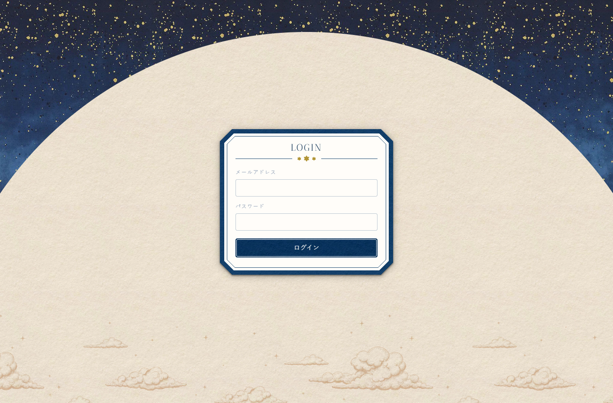

# 詳細設計: ログイン画面

## 1. UI要件・操作フロー

### 画面構成

- カード型のUI（装飾付きフレーム・ヘッダー・ボディ）
- 最大幅 400px、画面中央寄せ

### 操作フロー

1. メールアドレス・パスワードを入力して送信
2. ローディング中: ボタンをスピナーに差し替え、全フィールドを `disabled` にする
3. 認証成功: `/`（ダッシュボード）にリダイレクト
4. 認証失敗: エラーメッセージをフォーム内に表示（ダイアログなし）

## 2. フォームのバリデーション

| フィールド     | type       | maxLength | required |
| -------------- | ---------- | --------- | -------- |
| メールアドレス | `email`    | 254       | ✓        |
| パスワード     | `password` | 128       | ✓        |

- HTML標準バリデーション（`required`, `type="email"`）のみ使用
- カスタムバリデーションなし（サーバー側で行う）

## 3. エラーメッセージ

エラーはフォーム内（送信ボタンの上）にテキストで表示する。`alert()` は使わない。

| 条件                           | 表示メッセージ                           |
| ------------------------------ | ---------------------------------------- |
| レート制限に引っかかった場合   | 時間をおいてからログインしてください     |
| メール・パスワードが一致しない | メールアドレスまたはパスワードが違います |
| サーバーエラー                 | サーバーエラーが発生しています           |

レート制限の判定: `signIn()` のレスポンス `result.code === 'rate_limited'` で区別する。

## 4. ローディング状態

- 送信中: ボタンのラベルを円形スピナー（CSS アニメーション）に差し替え
- フィールドと送信ボタンを `disabled` にしてダブルサブミットを防止
- 認証成功後はリダイレクト中もローディング状態を維持したまま（`setLoading(false)` を呼ばない）

## 5. 認証ライブラリとの接続

- `next-auth/react` の `signIn('credentials', { email, password, redirect: false })` を使用
- `redirect: false` にして結果をフロント側で受け取り、エラー表示とリダイレクトを自前で制御する
- 認証成功時は `router.push('/')` でダッシュボードへ遷移
